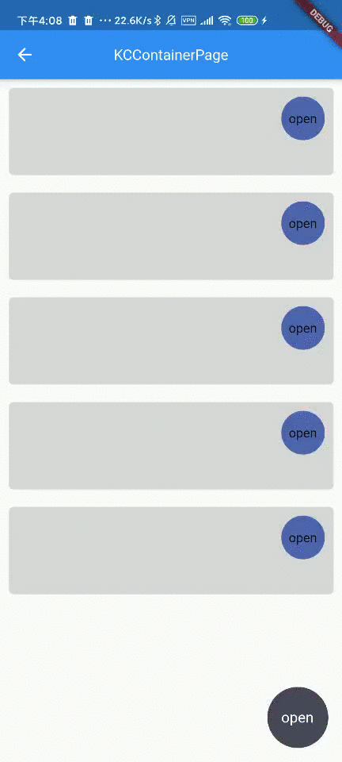
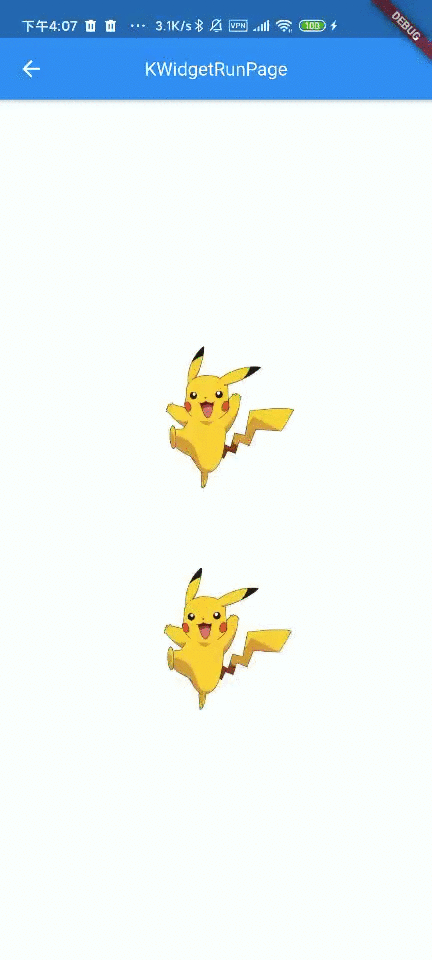

# flutter_kira

common widget for project

[](https://pub.dev/packages/flutter_kira)

## All Widget

*[KContainer](https://github.com/k1r3zz/kira_widget/blob/master/lib/kira_container.dart)

*[KText](https://github.com/k1r3zz/kira_widget/blob/master/lib/kira_text.dart)

*[KAutoText](https://github.com/k1r3zz/kira_widget/blob/master/lib/kira_auto_text.dart)

*[KBoolWeight](https://github.com/k1r3zz/kira_widget/blob/master/lib/kira_bool_widget.dart)

*[KCContainer](https://github.com/k1r3zz/kira_widget/blob/master/lib/kira_circle_container.dart)

*[KFlowButton](https://github.com/k1r3zz/kira_widget/blob/master/lib/kira_flow_button.dart)

*[KWidgetRun](https://github.com/k1r3zz/kira_widget/blob/master/lib/kira_widget_run.dart)

*[KCoverWidget](https://github.com/k1r3zz/kira_widget/blob/master/lib/kira_cover_widget.dart)

*[KImage](https://github.com/k1r3zz/kira_widget/blob/master/lib/kira_image.dart)

*[KDialog](https://github.com/k1r3zz/kira_widget/blob/master/lib/util/dialog_util.dart)

*[KScreen](https://github.com/k1r3zz/kira_widget/blob/master/lib/util/kira_screen.dart)

## Example Widget

<!--This project is a starting point for a Dart-->
<!--[package](https://flutter.dev/developing-packages/),-->
<!--a library module containing code that can be shared easily across-->
<!--multiple Flutter or Dart projects.-->

<!--For help getting started with Flutter, view our-->
<!--[online documentation](https://flutter.dev/docs), which offers tutorials,-->
<!--samples, guidance on mobile development, and a full API reference.-->

<!---->
<!---->
<!---->
<!---->


|  |  |
|:--------------------------------------------------------|:---------------------------------------------------------|
| [KCoverWidget](#kcoverwidget)                           | [KCContainer](#kccontainer)                                             |
|  |    |
| KFlowButton                                             | KWidgetRun                                               |

### KCoverWidget
_Example
```
 KCoverWidget(
              overHeight: 90,
              downStr: "点击更多详情",
              child: Column(
                //mainAxisAlignment: MainAxisAlignment.start,
                children: [
                  Text(
                    "大家好我是KCoverWidget大家好我是KCoverWidget大家好我是KCoverWidget大家好我是KCoverWidget大家好我是KCoverWidget大家好我是KCoverWidget大家好我是KCoverWidget大家好我是KCoverWidget大家好我是KCoverWidget大家好我是KCoverWidget大家好我是KCoverWidget大家好我是KCoverWidget大家好我是KCoverWidget大家好我是KCoverWidget大家好我是KCoverWidget大家好我是KCoverWidget大家好我是KCoverWidget大家好我是KCoverWidget大家好我是KCoverWidget大家好我是KCoverWidget大家好我是KCoverWidget大家好我是KCoverWidget大家好我是KCoverWidget大家好我是KCoverWidget大家好我是KCoverWidget大家好我是KCoverWidget大家好我是KCoverWidget大家好我是KCoverWidget大家好我是KCoverWidget",
                    // overflow: TextOverflow.visible,
                  ),
                  // Container(height: 120,color: mColors.c_333333,),
                ],
              ),
            ),
```

### KCContainer
_Example
```
 KCContainer(
            height: KScreen.realHeight,
            width: KScreen.screenWidth,
            pointController: mpointController,
            offset: Offset(KScreen.screenWidth - 65, KScreen.realHeight - 65),
            child: Container(
              color: mColors.c_516DB3,
              child: Image.asset(R.assetsImagesP4),
            ),
          )
      
```